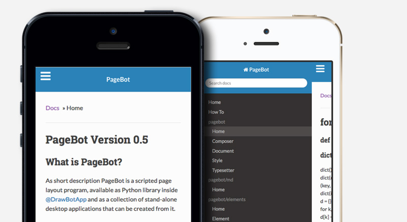
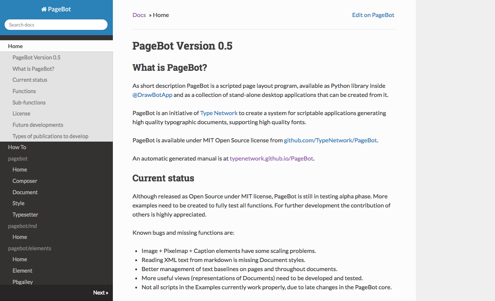

~~~Python
cid = 'Simple Site'

doc.lib['footer'] = "Footer of the page. Footer of the page. Footer of the page. Footer of the page. Footer of the page. Footer of the page."

doc.title = doc.name = 'Design&nbsp;Design&nbsp;Space'
page = doc[1]
box = page.deepFind('Logo')
~~~
# PageBot:1

~~~Python
box = page.select('HeroIntroduction')
~~~
## *What are the dreams and dragons* in your design process? How do you change a plan into a planning and mistakes into treasures? Where can you find the design space to develop?

~~~Python
box = page.select('HeroSlides').newSlide()
~~~

~~~Python
box = page.select('HeroSlides').newSlide()
~~~

~~~Python
box = page.select('HeroSlides').newSlide()
~~~

~~~Python
box = page.select('Content')
~~~

# Repeat to improve

What makes a design process *fundamentally* different from a production process, is that repetition improves the result. Starting with quick sketches, ignoring most details, next steps take more time. It’s not a linear process, it’s an iterative process, which means repeating the previous step in more detail.

~~~Python
box = page.select('Content2')
~~~

# Repeat to improve again

Second context box. *DesignDesign.Space* is an online coaching environment to develop your design skills. Query your questions and improve your sketching. Acquire new techniques and research your way of presentating. In short, a space where you can design your design process. 

~~~Python
box = page.select('ColoredSectionHeader')
~~~
# Some things in rows of 3 columns

~~~Python
box = page.select('ColoredSection0')
~~~
## Something

*DesignDesign.Space* is an online coaching environment to develop your design skills. Query your questions and improve your sketching. Acquire new techniques and research your way of presentating. In short, a space where you can design your design process. 

~~~Python
box = page.select('ColoredSection1')
~~~
## Something else

By definition designers are bad planners. It seems to be fundamental to design. Too optimistic in the beginning – “There is still plenty of time”, a design is never finished – “The next one will always be better”. 

~~~Python
box = page.select('ColoredSection2')
~~~
## Something more

The core idea behind designing the design process, is that it doesn’t make a difference for how long you do it. A project of 1 hour, basically goes through the same stages (research – design – presentation) as a project of 1 year. 

~~~Python
box = page.select('Footer').append(doc.lib['footer'])
~~~
 
~~~Python
# -----------------------------------------------------------
page = doc[2]
box = page.select('Logo')
~~~
# PageBot:2

~~~Python
box = page.select('HeroSlides').newSlide()
~~~

~~~Python
box = page.select('HeroSlides').newSlide()
~~~

~~~Python
box = page.select('HeroSlides').newSlide()
~~~

~~~Python
box = page.select('HeroIntroduction')
~~~
## Here is another text. What are the dreams and dragons in your design process? How do you change a plan into a planning and mistakes into treasures? Where can you find the design space to develop?

~~~Python
box = page.select('Footer').append(doc.lib['footer'])
~~~

~~~Python
page = doc[3]
box = page.select('Logo')
~~~
# PageBot:3

~~~Python
box = page.select('HeroSlides').newSlide()
~~~

~~~Python
box = page.select('HeroSlides').newSlide()
~~~

~~~Python
box = page.select('HeroSlides').newSlide()
~~~

~~~Python
box = page.select('HeroIntroduction')
~~~
## Here is another text. What are the dreams and dragons in your design process? How do you change a plan into a planning and mistakes into treasures? Where can you find the design space to develop?

~~~Python
box = page.select('Footer').append(doc.lib['footer'])
~~~

~~~Python
page = doc[4]
box = page.select('Logo')
~~~
# PageBot:4

~~~Python
box = page.select('HeroSlides').newSlide()
~~~

~~~Python
box = page.select('HeroSlides').newSlide()
~~~

~~~Python
box = page.select('HeroSlides').newSlide()
~~~

~~~Python
box = page.select('HeroIntroduction')
~~~
## Here is another text. What are the dreams and dragons in your design process? How do you change a plan into a planning and mistakes into treasures? Where can you find the design space to develop?

~~~Python
box = page.select('Footer').append(doc.lib['footer'])
~~~

~~~Python
page = doc[5]
box = page.select('Logo')
~~~
# PageBot:5

~~~Python
box = page.select('HeroSlides').newSlide()
~~~

~~~Python
box = page.select('HeroSlides').newSlide()
~~~

~~~Python
box = page.select('HeroSlides').newSlide()
~~~

~~~Python
box = page.select('HeroIntroduction')
~~~
## Here is another text. What are the dreams and dragons in your design process? How do you change a plan into a planning and mistakes into treasures? Where can you find the design space to develop?

~~~Python
box = page.deepFind('Footer').append(doc.lib['footer'])
~~~
