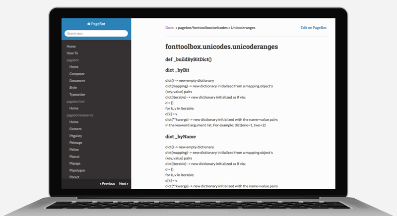

~~~Python
cid = 'Simple Site'

doc.lib['footer'] = "Footer of the page. Footer of the page. Footer of the page. Footer of the page. Footer of the page. Footer of the page."

doc.title = doc.name = 'Design&nbsp;Design&nbsp;Space'
page = doc[1]
box = page.deepFind('Logo')[0]
~~~
# PageBot+1
~~~Python
box = page.deepFind('Introduction')[0]
~~~
## What are the dreams and dragons in your design process? How do you change a plan into a planning and mistakes into treasures? Where can you find the design space to develop?

~~~Python
box = page.deepFind('HeroImages')[0]
~~~

~~~Python
box = page.deepFind('Content')[0]
~~~

# Repeat to improve

What makes a design process *fundamentally* different from a production process, is that repetition improves the result. Starting with quick sketches, ignoring most details, next steps take more time. It’s not a linear process, it’s an iterative process, which means repeating the previous step in more detail.

~~~Python
box = page.deepFind('ColoredSectionHeader')[0]
~~~
# Some things in rows of 3 columns

~~~Python
box = page.deepFind('ColoredSection0')[0]
~~~
## Something

Lorem ipsum dolor sit amet, consectetur adipisicing elit, sed do eiusmod tempor incididunt ut labore et dolore magna aliqua. Ut enim ad minim veniam, quis nostrud exercitation ullamco laboris nisi ut aliquip ex ea commodo consequat.

~~~Python
box = page.deepFind('ColoredSection1')[0]
~~~
## Something else

Lorem ipsum dolor sit amet, consectetur adipisicing elit, sed do eiusmod tempor incididunt ut labore et dolore magna aliqua. Ut enim ad minim veniam, quis nostrud exercitation ullamco laboris nisi ut aliquip ex ea commodo consequat. Ut enim ad minim veniam, quis nostrud exercitation ullamco laboris nisi ut aliquip ex ea commodo consequat.

~~~Python
box = page.deepFind('ColoredSection2')[0]
~~~
## Something more

Lorem ipsum dolor sit amet, consectetur adipisicing elit, sed do eiusmod tempor incididunt ut labore et dolore magna aliqua. Ut enim ad minim veniam, quis nostrud exercitation ullamco laboris nisi ut aliquip ex ea commodo consequat.

~~~Python
box = page.deepFind('Footer')[0].append(doc.lib['footer'])
~~~
 
~~~Python
# -----------------------------------------------------------
page = doc[2]
box = page.deepFind('Logo')[0]
~~~
# PageBot+2

~~~Python
box = page.deepFind('HeroImages')[0]
~~~

~~~Python
box = page.deepFind('Introduction')[0]
~~~
## Here is another text. What are the dreams and dragons in your design process? How do you change a plan into a planning and mistakes into treasures? Where can you find the design space to develop?

~~~Python
box = page.deepFind('Footer')[0].append(doc.lib['footer'])
~~~

~~~Python
page = doc[3]
box = page.deepFind('Logo')[0]
~~~
# PageBot+3

~~~Python
box = page.deepFind('HeroImages')[0]
~~~

~~~Python
box = page.deepFind('Introduction')[0]
~~~
## Here is another text. What are the dreams and dragons in your design process? How do you change a plan into a planning and mistakes into treasures? Where can you find the design space to develop?

~~~Python
box = page.deepFind('Footer')[0].append(doc.lib['footer'])
~~~

~~~Python
page = doc[4]
box = page.deepFind('Logo')[0]
~~~
# PageBot+4

~~~Python
box = page.deepFind('HeroImages')[0]
~~~

~~~Python
box = page.deepFind('Introduction')[0]
~~~
## Here is another text. What are the dreams and dragons in your design process? How do you change a plan into a planning and mistakes into treasures? Where can you find the design space to develop?

~~~Python
box = page.deepFind('Footer')[0].append(doc.lib['footer'])
~~~

~~~Python
page = doc[5]
box = page.deepFind('Logo')[0]
~~~
# PageBot+5

~~~Python
box = page.deepFind('HeroImages')[0]
~~~

~~~Python
box = page.deepFind('Introduction')[0]
~~~
## Here is another text. What are the dreams and dragons in your design process? How do you change a plan into a planning and mistakes into treasures? Where can you find the design space to develop?

~~~Python
box = page.deepFind('Footer')[0].append(doc.lib['footer'])
~~~
