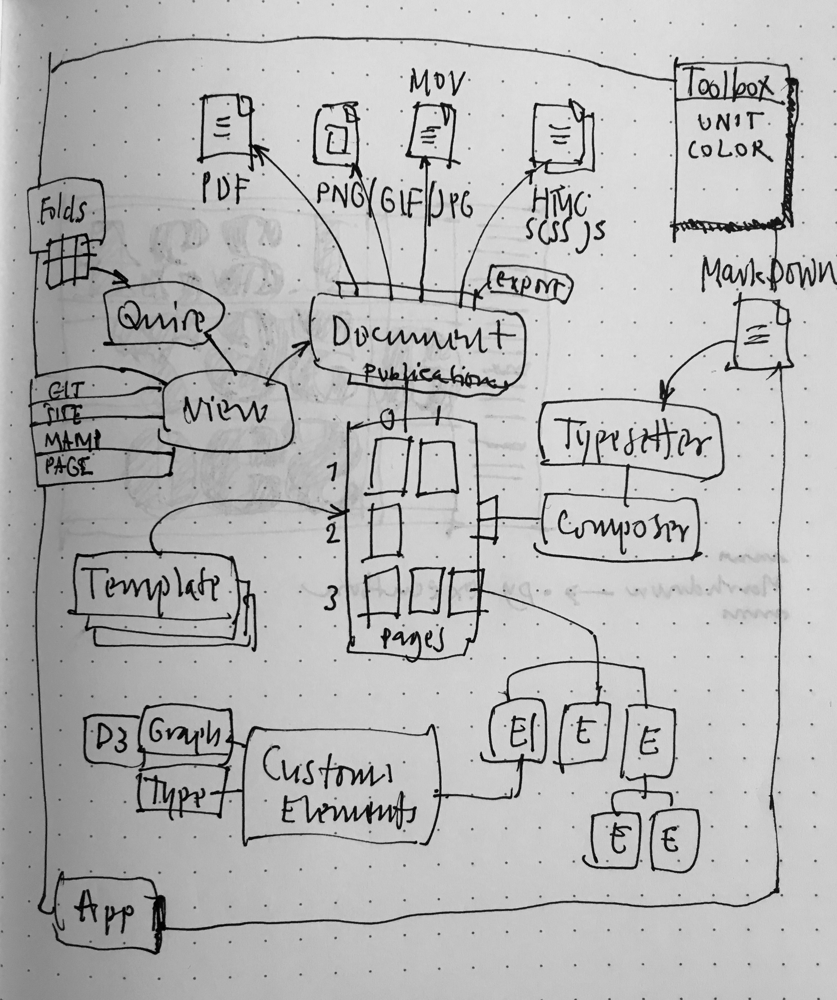

# Guided Tour PageBot

The aim of this Guided Tour is to give an overview – as in a lesson or workshop – of what is inside PageBot, how it can be used and where to find the functions.

Most of the PageBot Python code it richly commented and most of the functions, classes and methods have *doctests*, used both for testing the validity of the code as well as a condensed "manual” if its usage.

The Tour will show examples of the most important Python3 classes in the library. An overview of their relations can be viewed here.

## Tools for this tour

### MacDown

This file (and all other MarkDown files (extension *.md*) can best be viewed and modified using a MarkDown editor. We have good experience with MacDown. 

Free license: [https://macdown.uranusjr.com](https://macdown.uranusjr.com)

### Sublime 

The Pagebot library code can be viewed and modified by Sublime (and other Python-based editors). And advantage of Sublime is that code can be executed from inside the editor, so it can run the doctests with direct feedback about validity of the code.

The generated documents (typically generated inside the local "_export" folder) can be opnened in the Adobe Acrobat Reader or the OSX-Preview application. We have the best experience with the latter, because after running a script the Preview updates the PDF-preview, where the Acrobat Reader needs to close-open the document again to show changed.

Sublime has a payed license: [https://www.sublimetext.com](https://www.sublimetext.com)

### DrawBot

PageBot started as library inside DrawBot. Most the typographic text functions and and that drawing tools are based on the API of DrawBot. Besides running in Sublime, DrawBot

Free license: [http://www.drawbot.com](http://www.drawbot.com)
(Download the Python 3.6 version, as PageBot now is entirely Python3. Version 2.7 is no longer supported.

MIT based open source: [https://github.com/typemytype/drawbot](https://github.com/typemytype/drawbot)

### PageBot git-repository

This respository hold the entire *import pagebot* module in *Lib/pagebot* and a large number of relative simple script in *Examples* the illustrate specific functions and coding patterns.

MIT based open source: [https://github.com/TypeNetwork/PageBot](https://github.com/TypeNetwork/PageBot)

### PageBotExamples git-repository

MIT based open source: [https://github.com/TypeNetwork/PageBotExamples](https://github.com/TypeNetwork/PageBotExamples)

### PageBot Install and Setup.

* Download the PageBot git repository
* Read the README.md
* Install PageBot for Python3 from the INSTALL.mg guideline, using *setup.py*
* Read this Guide Tour, and try to execute the small code examples in DrawBot+PageBot. And try to run the referenced  example scripts in Sublime or DrawBot, to check against the example images in this file.

# Folders and Files

## Highlights in the code files

First, let us look through some of the most important and illustrative source files. 

### document.py

Contains the Python3 class *Document*, which is main source of information in a publication-generating script. Amongst many, there are 3 main types of data that the *Document* holds:

* Root-style: The root dictionary that defines the default values for all parameters in the page-element tree.
* Matrix of pages, organized by (page-index) coordinate.
* An active view, that defineds the viewing parameters (such as the on/off showing of gridlines and crop marks) and the type of requested output format.

#### Sample code fragment
~~~
from pagebot.document import Document
doc = Document(w=500, h=500, title='Demo')
print(doc)
~~~

### style.py

Contains the definition of the main root style of PageBot. All parameters (location, metrics, typography, viewing parameters) have a defined name in the root style dictionary. 
Each of these values are used as default, unless they are redefined on a lower level in the document-page-element tree. 

#### Sample code fragment
~~~
from pagebot.style import getRootStyle
rootStyle = getRootStyle()
print(rootStyle['baselineGrid']) # Results in 15pt
~~~

### constants.py

This file contains the “database” of static values that are used in the system, such as standard page and screen sizes, color conversion, font-style names, language-codes, grid types and file types.

#### Sample code fragment
~~~
from pagebot.constants import A4, Tabloid, GRID_OPTIONS
print(A4)
print(Tabloid)
print(GRID_OPTIONS)
~~~
Note that the measures show their type. All measures in PageBot are of type *Unit*, which keeps its value in context, without a rounding calculation.

### typesetter.py

The *Typesetter* class reads a MarkDown file (such as this one), and converts it into an HTML tree of objects. This can then be converted into formtatted strings for PDF, or kept as it is for the use in HTML export files.

The Typesetter is the bridge between contents MarkDown files, creating a *Galley* element, that holds an endless list of elements found in the MarkDown (codeblock, text, images, rulers, etc.). Therefor is the Typesetter often used in combination with the *Composer*, that knows how to distribute the *Galley* content on pages, doing the actual page layout.

#### Sample code fragment
~~~
from pagebot.typesetter import Typesetter
from pagebot.contexts.platform import getContext
from pagebot import getResourcesPath
context = getContext() # Answers the DrawBot context
# Find the path to a TEST.md file in resources.
path = getResourcesPath() + "/texts/TEST.md"
ts = Typesetter(context) # Create a Typesetter instance
tree = ts.typesetFile(path) # Parse the MarkDown content and create a tree.
# Show the text of the first 
 text block of the TEST.md
print(tree.elements[1].bs) 
~~~

### elements/element.py

*Element* is the base class for all elements (which is instance that can be placed on a *Page*, including other pages and views).
All generic functions of elements is bundled in this file. 
Notices that many of the style parameters are also accessable by property. The naming of the parameters may seem bit cryptic at start (e.g. *element.mr* is the margin-right of an element), but as they are used so often it saves a lot of typing.
The abbreviations are intended to be intuitive. See the *style.py* for their names, default values and descriptions.

#### Sample code fragment
~~~
from pagebot.elements import Element
e = Element(x=100, y=100, w=200, h=300)
print(e.box) # Show the box of the element
e.ml = 20
print(e.margin) # Show the margins around the element
~~~

### elements.pbpage.py

*Page* is the global container of elements, where in most cases the *Document* is the parent. But as *Page* inherits from the *Element* class, it can also be placed on another page. This way manuals can be made, that contain pages as illustrations.

Besides this standard behavior, a page also has some specific characteristics. Partly this is based on the special behavior of HTML-pages, that need to contain *head* parts, with *css* and *javascript* defined. The *Page* acccomodates such specific information to be stored.

#### Sample code fragment
~~~
from pagebot.elements.pbpage import Page
from pabebot.elements.pbrect import Rect
page = Page(w=500, h=500)
Rect(10, 10, 30, 40, parent=page)
print(page.fileName) # Default for HTML export
print(page.jsUrls)
print(page.elements[0])
~~~

### elements/views/pageview.py

This source defines the *PageView* class, that takes care of the viewing parameters when exporting static documents for print, such as drawing grids and cropmarks. The *PageView* class is the default view of a *Document*.
The available view parameters can be found in the definition of the root style in *style.py*.

#### Sample code fragment
~~~
from pagebot.document import Document
from pagebot.toolbox.units import inch
doc = Document(w=500, h=500)
view = doc.view # Get the default view on the document
view.padding = inch(1) # Make space around the page
view.showCropMarks = True # Show crop marks on page corners
view.showGrid = True # Show a default type of grid
view.showFrame = True # Show the frame of the page.
~~~

### toolbox/color.py

The *Color* class converts between various types of colors, keeping the original value as source (to avoid cumulative roundings). 

#### Samepl code fragment
~~~
from pagebot.toolbox.color import color
c = color(1, 0, 0) # Create an RGB flavoured color
print(c)
print(c.darker()) # Darker version
print(c.cmyk) # As CMYK
print(c.spot) # Closest spot color
c = color(spot=300) # Spot color 300 as source
print(c.rgb) # As closest RGB
print(c.ral) # As closest RAL
~~~

### toolbox/dating.py

The *Dating* and *Duration* classes offer a wide variety of absolute and relative date-time calculations. 

#### Sample code fragment
~~~
from pagebot.toolbox.dating import Dating, Duration, days, hours
date = Dating(date='now') 
print(date)
print(date + 6)
~~~
*(dating.py needs more debugging)*

### toolbox/units.py

The *Unit* is an extended and very usefull measurement class with *Pt* (points), *Mm* (millimeters), *P* (picas), *perc* (%), *em*, *degrees* and other. This way measures keep their own accuracy without intermediate roundings. They know how to transform into each other.

#### Sample code fragment
~~~
from pagebot.toolbox.units import pt, mm, perc, p, units
from pagebot.constants import A4, Tabloid
print(units('3mm')) # Interpret from string
print(mm(3)) # Create by function
print(mm(1,2,3,4,5,6)) # Create tuple of Mm instances
print(pt(10) + mm(10)) # Adding keeps first type
print(mm(10) + pt(10))
print(10 * mm(120)) # Integers adapt to closest Unit type

### 
## Design and coding process

## Design patterns

## Output formats

## Directions for PageBot