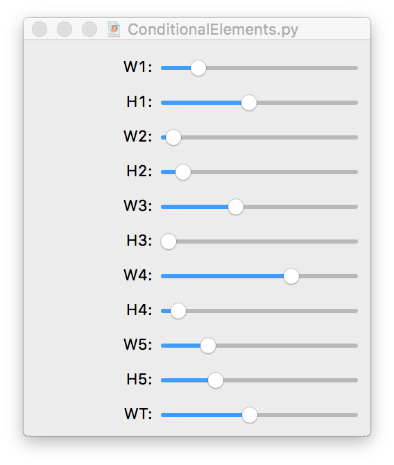

# Single Page Examples
Example scripts, creating a single page document, with focus on a limited amount of functions in PageBot/DrawBot.

## Color Squares

The script draws a matrix of 5x5 squares and circles in random colors, and an indicator of their position. indicating where their position is. This script is using the style parameters "originTop", making the coordinate system run downwards from top-left downwards.

The indicators on top of the squares show the relation between the two types of positioning schemas.

The functions *x2cx(x)*, *y2cy(y)* are used to calculate from point coordinates to colum and row indices (wich can be fractional).
Note that these functions are used to demonstrate the principle. All elments hace their column/row position available as *(e.cx, e.cy)* property attributes.

The scripts also illustrates the difference between DrawBot (drawing squares and circles) and PageBot (drawing pages en elements). Where in DrawBot all drawing instructions are executed when called, PageBot collects the various types elements and thei positions in parent elements. Instructions as *document.export(fileName)* will subsequentially calls the DrawBot drawing functions to export a finished document into a drawing or file.

## Column Squares

This script is similar to *colors	quares.py*, but instead this one calculates from column/row indices to point positions, with similar result.

The values *sqx* and *sqy* are calculated to hold the amount of 5x5 squares. 
The *for-next* loop *for ix in range(sqx)* runs through the range of column indices.

## Conditional Elements

This script shows the working of conditions with elements. Each element gets an optional list of *Condition* instances that evaluate a score for the amount of fitting the conditions. The conditions are evaluated in the order as defined. They also supporting the *e.solve()* function, which implements a possible solution to improve the current score value, e.g. by moving or resizing elements.

In this example script a number elements has floating conditions to define their positions as a stacked layout, similar to *float* status of *div* elements in CSS.

The width and height of the elements can be altered by sliiders, to see the result in the stacked layout if the size of elements overlaps.

## Simple Grid Poster
This script shows the usage of a grid, columns/rows and gutter. The script is very short, showing the power of highlevel publication classes, such as *Poster*.

*(Layout needs to be completed.)*

## Text Elements

Text elements can be connected, in the same way as text frames in InDesign. Text overflow in one element continues placement in the next element of the chain.
Also visible how image element show if they don't contain a valid image path. 
In this example both column/row grid is draw, as well as the baseline grid.

