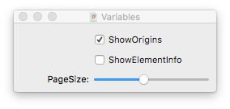
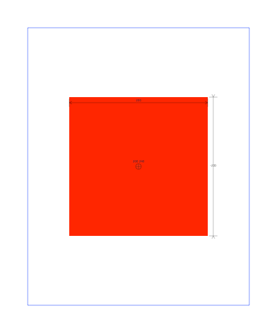
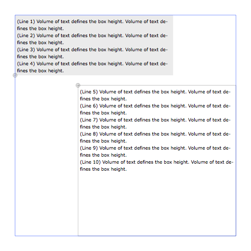

# How to...
Example scripts, how to do a specific task or explaining a single PageBot functions.

## Align elements


The script shows the different alignment conditions. *Left2Left()* goes to the left padding. *Left2LeftSide()* goes to the left side of the document.
*page.solve()* tries to solve any condition that does not fit the defined optimal value.



The Variable UI window shows how to implement checkbox and slider to manipulate certain values in the page. 

## Scale an image (DrawBot)

Since image scaling in DrawBot needs to be done by canvas scaling, the position of the image needs to be scaled in reverse. This examples shows how to do it.


## Sierpinski Square (DrawBot)
Example of an animated gif in DrawBot.


## Draw Red Rectangle Center Page

Simple demo to show the positioning of a colored rectangle centered on the page. Also the alignment origin of the rectangle is centered. The view draws cropmarks, page frame and rectangle origin marker.



## Draw View Page Frame

Simple test to show the working of view and page. Option Variable checkbox to set the origin to top or bottom.

## Draw Quadratic Glyph

Shows how to load a Truetype font and draw a glyph with quadratic Bézier curves with the cubic Bézier curves that PageBot uses.


## Use text flows

The example shows two floating colums of text, where th overflow of one goes into the other. If the second one also overflows, the remaining text goes into a column on the third page.



## Advanced Hyphenation

A proposal for advanced hyphenation:
For hyphenation head and tail (the minimum amound of charaters before / after a hyphenation), the FormattedString will need these arguments (headHyphenation=4, tailHyphenation=3).
These values are needed in drawBot.context.baseContext.BaseContext.hyphenateAttributedString. How to get them there?
(See HowTo/AdvancedHyphenation.py)

## Use Doctests

Doctests are an implementation of unit tests in Python. They are useful to make sure your software actually works as you expect it to. You can run a doctest on a single file like this:

    python -m doctest -v <path-to-file>.py

For `glyph.py`, for example, output containing errors could look something like this:

```
2 items passed all tests:
   3 tests in glyph.Point
  11 tests in glyph.Segment
**********************************************************************
1 items had failures:
  19 of  21 in glyph.Glyph
35 tests in 49 items.
16 passed and 19 failed.
***Test Failed*** 19 failures.
```

Of course, a solid piece of software should pass all the tests. By running the builddoc.py script with `-d`, we can run doctest on all the files in our library.

## Builddoc

The `builddoc.py` checks the code for errors and generates the documentation files. You  can run it on the command line like this:

    python builddoc.py
    
However, it takes one or more arguments:

```
./builddoc.py -ctwho
-h, --help: prints this listing.
-c, --clear: clears .pyc files.
-w, --write: writes the markdown files to the doc folder.
-d, --doctest: runs doctests on the pagebot module and HowTo files.
-l, --log: outputs to log, takes log file name as argument.
```

### Clear

Clears all `.pyc` files to make sure no old compiles are left.

### Write

The `-w` option formats and writes the docstrings to markdown files and copies handwritten markdown files to the folder that serves the documentation files, `Docs`. It will also generate the `mkdocs.yml` file next to the `Docs` folder. If the script finishes without errors, you should be ready to run

    mkdocs serve

To preview the results on [http://localhost:8000](http://localhost:8000). This will return something like this:

```
INFO    -  Building documentation... 
INFO    -  Cleaning site directory 
[I 170705 13:14:15 server:283] Serving on http://127.0.0.1:8000
[I 170705 13:14:15 handlers:60] Start watching changes
[I 170705 13:14:15 handlers:62] Start detecting changes
```

Changes to the files will be updated live. Since they are generated, this means running the builddoc script again. Finally, you can deploy them to GitHub using this command:

    mkdocs gh-deploy

If all goes well, you should be able to view the updated documentation at [https://typenetwork.github.io/PageBot/](https://typenetwork.github.io/PageBot/) (case sensitive):

```
INFO    -  Cleaning site directory 
INFO    -  Building documentation to directory: /Users/michiel/Code/PageBot/site 
INFO    -  Copying '/Users/michiel/Code/PageBot/site' to 'gh-pages' branch and pushing to GitHub. 
INFO    -  Your documentation should shortly be available at: https://pagebot.github.io/PageBot/ 
``` 

### Doctest

See Use Doctests.

### Log

Sends the output to a log file instead of standard out, a filename such as `out.txt` is required.
