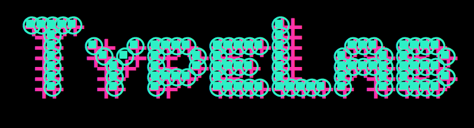
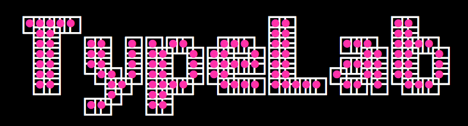

# Bitcount TypeNetwork specimen scripts

Requires the main package of TypeNetwork Bitcount to be installed.
If you don’t have a license, get a desktop license <a href="https://store.typenetwork.com/foundry/typetr/fonts/bitcount">here</a> for $101 (300 fonts).

##TypeLab 2017 Logo

Generate TypeLab 2017 logo alternatives and save them as PNG or PNG images in the _export folder. For these the Bitcount Mono spacing variant is used, but that can be changed in the code.

The options windows the available

